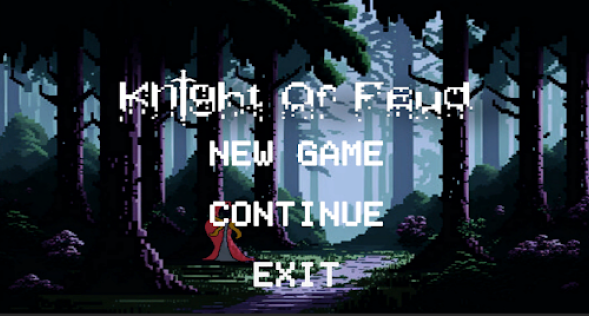
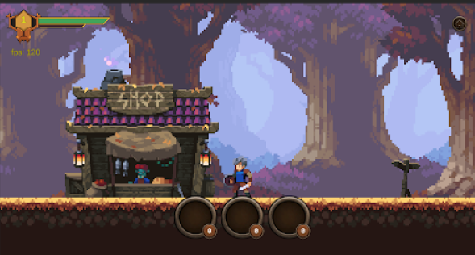
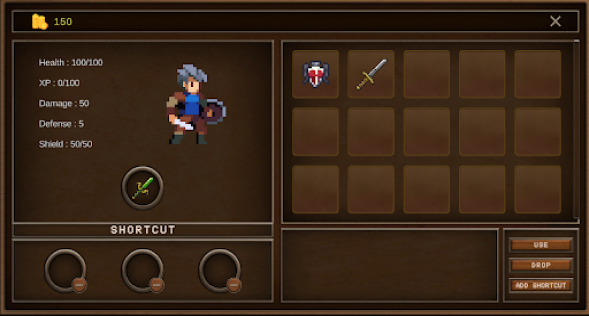
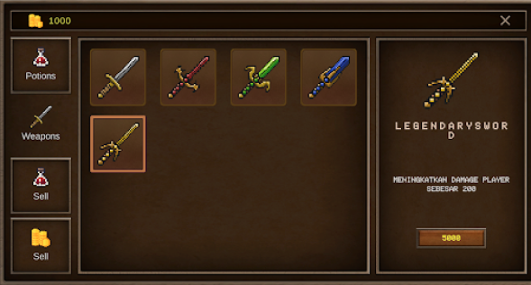

# Knight of Feud

## Description
**Knight of Feud** is a 2D pixel art game that combines elements of adventure, platforming, and fantasy with an engaging story. The game offers multiple controller options, including gamepad, mouse, and keyboard, providing a versatile and immersive gaming experience.

## Controls
### Movement
- **Keyboard**: Use the W and S
- **Gamepad**: Use the left stick to move

### Jump
- **Keyboard**: Use the Space or J keys
- **Gamepad**: Use the South button

### Slide
- **Keyboard**: Use the Left Shift or L keys

### Attack
- **Mouse**: Use the Left button
- **Keyboard**: Use the K key
- **Gamepad**: Use the designated attack button on the gamepad

### Shield
- **Mouse**: Use the Right button
- **Keyboard**: Use the Control key

## Game Screenshots
Here are some screenshots of the game:


*Main Menu*


*Gameplay*


*Gameplay - Inventory*


*Gameplay - Shop*

## Installation
To play **Knight of Feud**, follow these steps:

### Prerequisites
- Ensure you have Unity installed. You can download it from the [Unity official website](https://unity.com/).

### Running the Game
1. Clone this repository to your local machine:
    ```bash
    git clone https://github.com/yourusername/Knight-of-Feud.git
    cd Knight-of-Feud
    ```
2. Open the project in Unity:
    - Launch Unity Hub.
    - Click on the "Add" button and navigate to the folder where you cloned the repository.
    - Select the folder and open the project.
3. Once the project is open, click on the "Play" button in the Unity editor to start the game.

## License
This project is licensed under the MIT License. See the [LICENSE](LICENSE) file for more details.

## Contact
For any questions or suggestions, feel free to reach out to the project maintainer at [mrizkyr2411@gmail.com](mailto:mrizkyr2411@gmail.com).

---

Embark on an epic adventure and navigate through the challenges in **Knight of Feud**!
